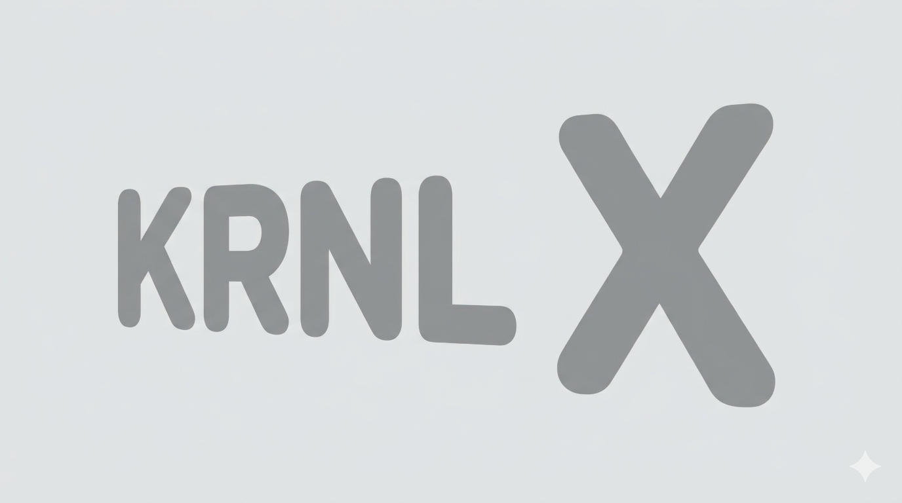

# KRNLx OS

> A modern, efficient, and customizable Ubuntu-based operating system built for performance, control, and flexibility.

---

## 📑 Table of Contents
- [Introduction](#-introduction)
- [KRNLx Facts](#-krnlx-facts)
- [Why KRNLx?](#-why-krnlx)
- [Ubuntu Features (Base System)](#-ubuntu-features-base-system)
- [KRNLx vs Ubuntu](#-krnlx-vs-ubuntu)
- [Features](#-features)
- [Installation](#-installation)
  - [Bootable USB Method](#-bootable-usb-method)
- [Usage](#-usage)
- [Configuration](#-configuration)
- [Commands](#-commands)
- [Examples](#-examples)
- [Troubleshooting](#-troubleshooting)
- [Dependencies](#-dependencies)
- [Contributors](#-contributors)
- [License](#-license)

---

## 📖 Introduction

**KRNLx OS** is a lightweight, powerful operating system based on Ubuntu, designed for users who want:
- ⚡ Speed and performance
- 🔒 Security and control
- 🧩 Deep customization
- 🛠 Developer-focused tools

---

## 📊 KRNLx Facts

- 🐧 Built on Ubuntu (stable and widely supported base)
- ⚙️ Custom KRNLx kernel enhancements
- 📦 Uses APT package system (compatible with Ubuntu repos)
- 🚀 Optimized for speed and low resource usage
- 🧠 Designed for advanced users, developers, and enthusiasts
- 🔧 Modular design (install only what you need)
- 💻 Supports both CLI and optional GUI environments

---

## ❓ Why KRNLx?

- 🚀 Faster than standard Ubuntu installs  
- 🧩 More customizable out of the box  
- 🧠 Built for power users and developers  
- 🔧 Less bloat, more control  
- 🔐 Enhanced security configurations  
- ⚙️ Tuned kernel for performance  

---

## 🐧 Ubuntu Features (Base System)

Since KRNLx is Ubuntu-based, it includes all the powerful features of Ubuntu:

- 📦 **APT Package Manager**  
  Easily install and manage thousands of packages  

- 🌐 **Large Software Repository**  
  Access to one of the biggest Linux ecosystems  

- 🔐 **Strong Security**  
  Regular updates and security patches  

- 🖥 **Hardware Compatibility**  
  Works on a wide range of devices  

- 👥 **Massive Community Support**  
  Tutorials, forums, and documentation everywhere  

- 🧰 **Developer Tools**  
  Native support for Python, C, C++, Node.js, and more  

---

## ⚔️ KRNLx vs Ubuntu

| Feature            | Ubuntu 🐧           | KRNLx ⚡                |
|--------------------|--------------------|------------------------|
| Performance        | Standard           | Optimized & faster     |
| Customization      | Moderate           | High                   |
| Pre-installed apps | Many (can be heavy)| Minimal (lightweight)  |
| Target users       | General users      | Power users / devs     |
| Kernel tuning      | Default            | Custom KRNLx tuning    |
| Bloat level        | Medium             | Low                    |

---

## ✨ Features

- ⚙️ Custom kernel (KRNLx Core)
- 🖥 Minimal UI (optional GUI)
- 📁 Advanced file system handling
- 🔌 Plugin/module system
- 🌐 Built-in networking stack
- 🧪 Experimental features for advanced users

---

## 💾 Installation

### 🔥 Bootable USB Method

#### Requirements
- USB drive (8GB+)
- KRNLx ISO file
- Rufus / balenaEtcher

---

### Step 1: Download ISO
Download the KRNLx `.iso` file.

---

### Step 2: Flash USB

#### Windows (Rufus)
- Insert USB
- Open Rufus
- Select ISO
- Click **Start**

#### Linux/macOS (Etcher)
- Open Etcher  
- Select ISO  
- Select USB  
- Click **Flash**

---

### Step 3: Boot

- Enter BIOS (`F2`, `DEL`, `ESC`)
- Select USB boot
- Start KRNLx installer

---

### Step 4: Install

- Choose **Install KRNLx**
- Follow setup instructions

---

## ▶️ Usage

- Use terminal or GUI  
- Install apps via `apt`  
- Customize system freely  

---

## 📦 Dependencies
Ubuntu base system
APT package manager
GRUB bootloader
Custom Boot Screen

---

## 👥 Contributors
Your Name – Creator of KRNLx

---

## 📜 License

MIT License

---

# ⭐ Final Notes

KRNLx combines the power of Ubuntu with performance and control.

“Built on Ubuntu. Unlocked by KRNLx.”

---
